# 📚 Books Analytics: Web Scraping & Visualization

> **A comprehensive project showcasing web scraping, data processing, and visualization skills**

[](https://python.org)
[](https://pypi.org/project/beautifulsoup4/)
[](https://pandas.pydata.org/)
[](https://www.sqlite.org/)
[](https://matplotlib.org/)

## 🎯 Project Overview

This project demonstrates a complete **data workflow** from web scraping to insights generation. I extracted comprehensive book data from [Books to Scrape](https://books.toscrape.com), processed it using SQL, and performed exploratory data analysis to uncover meaningful patterns in the book marketplace.

### 🔍 What Makes This Project Special?
- **End-to-End Data Workflow**: From raw web data to actionable insights
- **Multi-Technology Integration**: Python, SQL, and visualization libraries
- **Real-World Application**: Practical data science workflow
- **Clean, Production-Ready Code**: Well-structured and documented

## 🚀 Key Features

- ✅ **Automated Web Scraping** - Extracts book data including titles, prices, ratings, and availability
- ✅ **Data Cleaning & Transformation** - Handles missing values and standardizes formats
- ✅ **SQL Database Integration** - Efficient data storage and complex querying
- ✅ **Comprehensive EDA** - Statistical analysis and pattern discovery
- ✅ **Interactive Visualizations** - Clear, insightful charts and graphs
- ✅ **Scalable Architecture** - Easily adaptable for other e-commerce sites

## 🛠️ Tech Stack

| Category | Technologies |
|----------|-------------|
| **Web Scraping** | Python, BeautifulSoup4, Requests |
| **Data Processing** | Pandas, NumPy |
| **Database** | MySQL, SQL |
| **Visualization** | Matplotlib, Seaborn, Plotly |
| **Development** | Jupyter Notebook, Git |

## 📊 Project Workflow

```mermaid
graph LR
    A[🌐 Web Scraping] --> B[📄 CSV Storage]
    B --> C[🗄️ SQL Database]
    C --> D[🔍 Data Analysis]
    D --> E[📈 Visualizations]
    E --> F[💡 Insights]
```



### Phase 1: Data Extraction 🕷️
- Scraped **1000+ books** from Books to Scrape
- Extracted key attributes: title, price, rating, availability, category
- Implemented robust error handling and rate limiting
- Saved raw data to CSV for reproducibility

### Phase 2: Data Processing 🔧
- Loaded data into Mysql database for efficient querying
- Performed data cleaning and validation
- Created optimized table schemas with proper indexing
- Handled data type conversions and null values

### Phase 3: Exploratory Data Analysis 📈
- **Price Distribution Analysis**: Identified pricing patterns across categories
- **Rating Correlation**: Analyzed relationship between ratings and prices
- **Category Performance**: Discovered top-performing book categories
- **Availability Insights**: Examined stock patterns and trends


## 📁 Project Structure

```
WebScrapping-and-Data-Visualization/
│
├── 📜 scraper.py              # Main web scraping script
├── 📊 data_analysis.py        # EDA and statistical analysis
├── 🗄️ sql_queries.py          # Database operations
├── 📈 visualizations.py       # Chart generation
├── 📝 requirements.txt        # Project dependencies
├── 📋 books_data.csv          # Scraped data (output)
├── 🗃️ books_database.db       # SQLite database
├── 📓 analysis_notebook.ipynb # Jupyter notebook with analysis
└── 📸 visualizations/         # Generated charts and graphs
```

## 🔍 Key Findings & Analysis

### 📊 Data Overview
- **Total Books Scraped**: 1000+ books from multiple categories
- **Data Points Collected**: Title, Price, Rating, Availability, Category
- **Categories Covered**: 50+ different book genres
- **Data Quality**: Comprehensive cleaning and validation performed

### 📈 Analysis Performed
- **Price Distribution Analysis**: Examined pricing patterns across different categories
- **Rating Analysis**: Studied the distribution of customer ratings
- **Category Performance**: Analyzed book availability and popularity by genre
- **Statistical Insights**: Correlation studies between price, rating, and availability

*Detailed findings and visualizations are available in the analysis notebook*

## 📊 Sample Visualizations

The project generates several insightful visualizations:

1. **Price Distribution Histogram** - Shows pricing patterns across all books
2. **Rating vs Price Scatter Plot** - Reveals correlation between quality and cost
3. **Category Performance Dashboard** - Compares categories across multiple metrics
4. **Availability Heatmap** - Visualizes stock patterns by category

*Note: All visualizations are saved in the `visualizations/` directory*

## 🎯 Skills Demonstrated

### **Technical Skills**
- **Web Scraping**: BeautifulSoup, Requests, HTML parsing
- **Data Processing**: ETL workflows, data cleaning, validation
- **Database Management**: SQL queries, database design, optimization
- **Data Analysis**: Statistical analysis, correlation studies
- **Data Visualization**: Creating meaningful charts and dashboards

### Soft Skills
- **Problem Solving**: Handling dynamic web content and data inconsistencies
- **Project Management**: Structured approach from planning to execution
- **Documentation**: Clear code comments and comprehensive README
- **Attention to Detail**: Data quality assurance and validation

## 🚀 Future Enhancements

- [ ] **Real-time Dashboard** - Build interactive web dashboard with Flask/Dash
- [ ] **Machine Learning** - Implement price prediction models
- [ ] **API Development** - Create REST API for data access
- [ ] **Automated Scheduling** - Set up daily data updates with cron jobs
- [ ] **Cloud Deployment** - Deploy on AWS/Azure with automated workflows


## 👨‍💻 About the Developer

**Abhay Dahe** - Passionate Data Engineer & Python Developer

- 🔗 **LinkedIn**: [Connect with me](https://www.linkedin.com/in/abhay-dahe/)
- 📧 **Email**: [abhaydahe2206@gmail.com](abhaydahe2206@gmail.com)

---

⭐ **If you found this project helpful, please consider giving it a star!** ⭐

